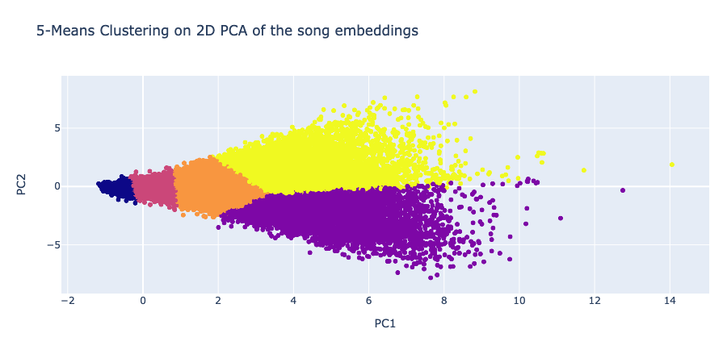

# Song2Vec

Project realized in the context of the Machine Learning for Behavioral Data (CS-421) class of 2021. Using the music listening history of a thousand users, composed of 20 million listens, we apply the word2vec method on the sequence of songs to extract information from music's context. Notably, we find similar contexts between songs from the same artist or within the same genre, or that by our song embeddings arithmetic the song Karma Police - Radiohead + Metallica = Where Is My Mind? from the Pixies. The gist of the project is the data analysis, in pandas, the methodology and the amount of data to handle. 

My contributions are:
* The Exploratory Data Analysis [`EDA.ipynb`](notebooks/EDA.ipynb), showing the incompleteness of the given dataset
* The classification tasks [`classification_tasks.ipynb`](./notebooks/classification_tasks.ipynb), on which we trained our song embeddings to extract information from the context
* The song embeddings clustering [`clustering.ipynb`](./notebooks/clustering.ipynb), illustrating the embeddings in 2-dimensional space
* The music genres API querying [`tags.ipynb`](./notebooks/tags.ipynb), using multithreading to query the tags associated to each song in a reasonable amount of time. The process took 2 days, due to the requests limit of the API
* The song embeddings relationships to artists and music genres, implemented in [`visualizations.ipynb`](./notebooks/visualizations.ipynb)
* The embedding arithmetic, explored in [`vector_artihmetic.ipynb`](./notebooks/vector_artihmetic.ipynb)

The [report](./report.pdf) explains in detail our approach and findings. Project members are Beatriz Borges, Michel Manon and Vignoud Julien.

## Project files

* `classification_tasks.ipynb`: Model comparisons on classifications tasks
* `clustering.ipynb`: Clustering and interpretation
* `EDA.ipynb`: Exploratory data analysis
* `data_cleaning.ipynb`: Data cleaning using MusicBrainz' database
* `hyperparam_finetuning.ipynb`: Song2Vec finetuning
* `tags.ipynb`: Tag scraping and processing
* `utils.py`: Script with common functions
* `vector_artihmetic.ipynb`: Exploratory notebook for operation on song embeddings
* `visualizations.ipynb`: Song2Vec 2D visualizations

